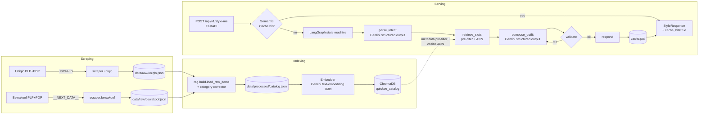

# Architecture — Quickeee Luxury Stylist Concierge

## 1. Bird's-eye view



## 2. Folder structure

```
src/quickee/
├── config.py          # pydantic-settings (.env loader, fail-fast on missing GEMINI_API_KEY)
├── models.py          # Item, StyleRequest, StyleResponse, RecommendedItem, AgentStep
├── scraper/
│   ├── base.py        # polite_browser ctx, JSON-LD / __NEXT_DATA__ extractors, retry
│   ├── normalize.py   # color + subcategory + category normalization
│   ├── uniqlo.py      # JSON-LD-based extractor
│   └── bewakoof.py    # __NEXT_DATA__-based extractor
├── rag/
│   ├── embeddings.py  # Gemini gemini-embedding-001 @ 768d, batched + retried
│   ├── build.py       # merge raw JSONs → validated processed catalog
│   ├── ingest.py      # embed catalog → ChromaDB
│   └── retriever.py   # pre-filter (category, color, price) + ANN
├── agent/
│   ├── state.py       # GraphState (TypedDict) + ParsedIntent + ComposedOutfit (Pydantic)
│   ├── prompts.py     # INTENT_SYSTEM + COMPOSE_SYSTEM + helpers
│   ├── nodes.py       # parse_intent_node, retrieve_slots_node, compose_outfit_node, validate_node, respond_node
│   └── graph.py       # build_graph() — explicit LangGraph state machine
├── cache/
│   └── semantic_cache.py  # prompt-embedding nearest-neighbour cache in ChromaDB
└── api/
    └── main.py        # FastAPI app: POST /api/v1/style-me, GET /health
scripts/
├── smoke_gemini.py    # one-shot key + embed check
├── scrape.py          # orchestrator for both scrapers
├── build_catalog.py   # merge raw → processed catalog + spec compliance report
└── ingest.py          # embed + push catalog to ChromaDB
```

## 3. Why each major design choice

### 3.1 Stack

| Choice | Alternatives considered | Why this one |
|---|---|---|
| **uv** for deps | poetry, pip-tools, hatch | Rust-based, 10–100× faster install, deterministic `uv.lock`, single tool |
| **Gemini** (chat + embeddings) | OpenAI, Anthropic, local Ollama | Generous free tier; Matryoshka embeddings let us shrink dims for cheap storage; one API key for both reasoning and vectors |
| **ChromaDB** local | Qdrant via Docker, Pinecone | Zero infra; supports pre-filtering on metadata before ANN; rebuildable in <2 min from scripts |
| **LangGraph** | LangChain LCEL, native | Explicit state machine — every node logs a trace, every edge is debuggable. Best match for the "agentic workflow" rubric |
| **Playwright** | Scrapy, httpx + BS4 | Modern fashion sites are JS-heavy; running Chromium also bypasses naive bot detection (browser-fingerprint matches a real user) |

### 3.2 Scraping pivot: H&M → Uniqlo + Bewakoof

The original spec named H&M as an example. We attempted H&M India and H&M US — both
returned `HTTP 403 Access Denied` from Akamai Bot Manager on every headless
Chrome request. Defeating commercial bot managers would require residential
proxies + undetected-chromedriver and would still be fragile.

**Pivot:** Uniqlo India (`uniqlo.com/in/en`) + Bewakoof (`bewakoof.com`) — both
permit standard headless Chromium and expose structured product data in the
DOM. We still meet the "two public fashion sites" requirement, and the data
extraction is dramatically more robust (see §3.4).

### 3.3 Structured data over CSS selectors

| Site | Source | Coverage |
|---|---|---|
| Uniqlo | `<script type="application/ld+json">` with a `@graph` array containing a `Product` node | name, description, price, currency, color, material, images[], mpn, url |
| Bewakoof | `<script id="__NEXT_DATA__">` Next.js SSG payload — `props.pageProps.productDetails` | name, price/mrp/member_price, description (list of HTML blocks), color {name, hexcode, parent_color_name}, product_attributes, images, canonical_url |

Reading these instead of CSS selectors is the production pattern: sites emit
this data for Google's crawler, so it's the most stable contract they have.
A CSS-selector scraper breaks on every visual refresh; a JSON-LD scraper
only breaks if the SEO team rewrites the schema (rare).

### 3.4 Catalog schema and ChromaDB metadata

Each `Item` carries:
- `id`, `brand`, `name`, `description`
- `price_inr` (number)
- `image_url`, `product_url`
- `category` ∈ {top, bottom}
- `subcategory` ∈ {tshirt, shirt, polo, sweater, hoodie, pants, shorts, jeans, chinos, jogger}
- `color` (normalized one-word: navy, white, gray, blue, black, brown, …)
- `material` (cotton, linen, blend, …) — optional

The same fields go into ChromaDB metadata, enabling **pre-filtered ANN
search** — Chroma's `where` clause runs against the HNSW payload before
distance computation, so retrieving "navy tops under INR 2000 ranked by
similarity to 'breezy summer linen'" is one call.

Embedding text concatenates `name + category + subcategory + color +
material + description`, so semantic matches respect the structured
attributes even before the metadata filter kicks in.

### 3.5 Agent state machine

```
START → parse_intent → retrieve_slots → compose_outfit → validate ─┐
                                              ▲                    │
                                              │ retry (max 1)      │ ok
                                              └─ compose_retry     ▼
                                                                respond → END
```

- **parse_intent** — Gemini `.with_structured_output(ParsedIntent)`. Extracts
  occasion, owned items (slot+color), color hints, slots_to_recommend,
  style_keywords.
- **retrieve_slots** — for each slot in `slots_to_recommend`, builds a
  semantic query and calls `Retriever.retrieve(category, color, max_price,
  k=5)`. Falls back to a relaxed filter if a strict color filter returned
  <2 hits.
- **compose_outfit** — Gemini `.with_structured_output(ComposedOutfit)`.
  Sees the candidate list (just id+name+brand+color+price; descriptions
  omitted to save tokens), picks one per slot, writes the Stylist Note.
- **validate** — Pydantic schema is already enforced by structured output;
  this node checks slot coverage, budget compliance, and id validity.
- **compose_retry** — same as compose with a counter bump; capped at 1.
- **respond** — terminal; the API handler reads the final state.

Every node appends a `trace` entry — this is what the demo recording shows
as "the agent's thought process".

### 3.6 Semantic cache (frugal mindset)

Lives in a sibling ChromaDB collection (`quickee_prompt_cache`).

On each request:
1. Embed the user prompt.
2. Query the cache for nearest-neighbour.
3. If `cosine_similarity ≥ SEMANTIC_CACHE_THRESHOLD` (default 0.93), return
   the cached `StyleResponse` and short-circuit — **no LLM calls, no agent
   run, no further embeddings**.
4. On miss, run the agent, then store (prompt_vector, response_json).

A near-duplicate prompt ("summer yacht party top with navy chinos" vs "what
should I wear with navy chinos to a yacht in summer") returns in <50ms
instead of 5–8s.

### 3.7 Prompt optimization techniques

1. **Schema-grounded prompts** — Gemini's `.with_structured_output(Pydantic)`
   injects a JSON spec into the system prompt and validates the response. No
   "parse the LLM output" code, no regex on free text.
2. **Minimal-context compose** — only id+name+brand+color+price per
   candidate are sent into the compose step, not the 500-char descriptions.
   Cuts compose-prompt tokens by ~80%.
3. **Two-temperature pattern** — parse_intent runs at temperature=0
   (deterministic extraction); compose_outfit runs at temperature=0.4 so the
   Stylist Note has personality without hallucinating product fields.
4. **Embedding deduplication** — rule-based color normalization happens once
   at ingestion; the agent never re-derives "Off White → white".

## 4. Local dev

```bash
uv sync
uv run playwright install chromium
cp .env.example .env  # paste GEMINI_API_KEY
uv run python scripts/smoke_gemini.py
uv run python scripts/scrape.py
uv run python scripts/build_catalog.py
uv run python scripts/ingest.py
uv run uvicorn quickee.api.main:app --reload
# open http://localhost:8000/docs
```

## 5. Files NOT to commit (already gitignored)

- `.env`
- `data/raw/`, `data/processed/` (regenerable in ~10 min)
- `chroma_db/` (regenerable in ~30s once catalog is built)
- `.playwright-browsers/` (~700 MB Chromium)
- `.venv/`, `__pycache__/`
